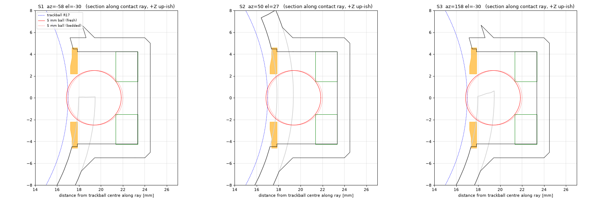
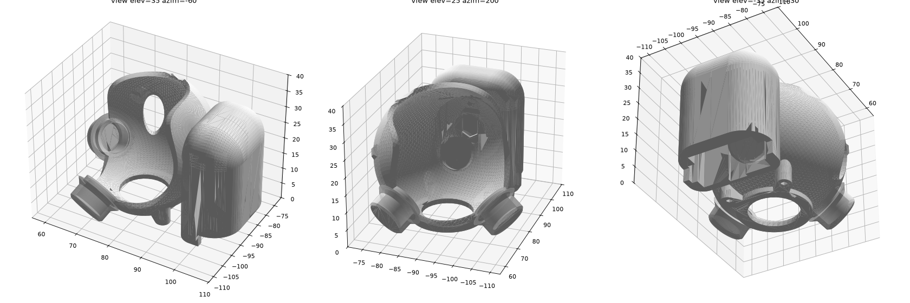
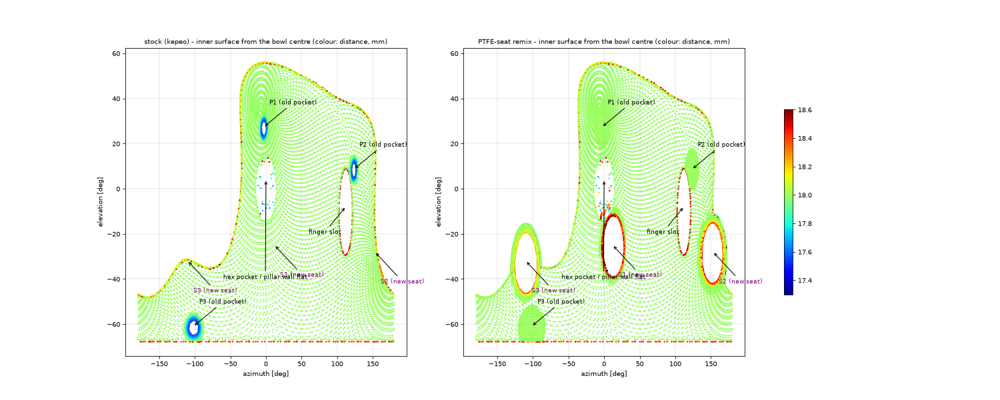

# Keyball 34 mm trackball case - PTFE-seat bearing upgrade

A remix of **kepeo's "Keyball Trackball Case"** (Thingiverse thing:6215791) that
replaces the three static 2 mm ceramic balls with three **5 mm chrome-steel balls
resting in the inner edge of thick PTFE washers**. The 34 mm ball rolls on the
steel balls; the steel balls slide on the PTFE ring, which cuts stiction with a
heavy (chromed steel, 160 g class) trackball. The PMW3360 sensor-to-ball distance
of the stock case is preserved exactly.




## Attribution and license

* Original design: **Keyball Trackball Case** by **kepeo**,
  <https://www.thingiverse.com/thing:6215791>, licensed
  **Creative Commons - Attribution (CC BY)**. The unmodified source STLs and
  kepeo's README/license text from the Thingiverse download are kept in
  `stock/original/`. Only the 34 mm / three-ceramic-ball case is used - not the
  Type D bearing case and not the 25 mm variants.
* This remix (everything in `src/`, `output/`, the docs) is also released under
  **CC BY 4.0**. Attribute kepeo for the case and this repository for the
  PTFE-seat modification.
* The Keyball44 PCB layout (Yowkees/keyball, MIT-licensed hardware files) was
  used only to check where the neighbouring key switches are.

## What is in the repository

| path | what |
|---|---|
| `src/ptfe_seat_case.py` | **parametric source** (CadQuery + manifold3d). All parameters at the top: ball diameter, washer ID/OD/thickness, contact radius, bedding bias, per-seat contact angles, boss size, bore undersize, cap dimensions. |
| `src/measure_stock.py` | reverse-engineers the stock STL: bowl sphere, the three 2 mm pockets, the trackball centre. Writes `src/stock_measurements.json`. |
| `src/write_dimensions.py`, `src/preview.py` | generate `DIMENSIONS.md` and the pictures from the build report. |
| `output/keyball_ptfe_seat_case_right.stl` / `.step.zip` | modified right-hand case. The STEP is a B-rep with true cylinders/planes for the seats on top of the faceted stock body; at 54 MB it is stored zipped (12 MB), unzip before use |
| `output/keyball_ptfe_seat_case_left.stl` / `.step.zip` | mirrored left-hand case (same build, mirrored inputs) |
| `output/cap_ring_OD9.1_hole4.4.*`, `..OD9.2..`, `..OD9.3..` | retention caps, three OD variants for press-fit selection (STEP + STL) |
| `output/test_coupon_seat.*` | one full seat stack (cap bore + step + washer bore + floor + backing) in a 14 mm puck, to dial in the fit before printing the case |
| `output/build_report_*.json` | every number the checks produced |
| `DIMENSIONS.md` | measured stock coordinates, the three chosen ball centres, all clearance results |
| `stock/original/` | kepeo's files as downloaded; `stock/repaired/` the same meshes made watertight (14 sliver triangles on the rim top re-triangulated, volume change 0.03 %) |

## Bill of materials

| qty | part | link |
|---|---|---|
| 3 | PTFE washer 3 mm ID x 8.5 mm OD x 2 mm thick (uxcell) | <https://www.amazon.com/dp/B08CD8TGF1> |
| 3 | 5 mm chrome steel ball, G25 (AISI 52100) | any bearing-ball supplier, e.g. <https://www.amazon.com/s?k=5mm+chrome+steel+ball+G25> |
| 1 | 34 mm trackball (chromed steel or stock POM) | - |
| 3 (optional) | printed retention cap (`output/cap_ring_OD9.2_hole4.4.stl`, or the 9.1 / 9.3 variant that fits) | this repo |
| 1 | printed case (`output/keyball_ptfe_seat_case_right.stl`) | this repo |
| 2 | the stock M1.7 flat-head tapping screws that hold the Keyball case to the daughterboard | Keyball kit |

Nothing else, nothing glued. PTFE cannot be bonded; every part is retained
mechanically (washer pressed into its counterbore, ball captive under the
optional cap, cap pressed against a hard step).

## The 19.5 mm rule (read this before editing anything)

The sensor distance is fixed by where the trackball rests, and the trackball
rests where its three support contacts put it.

* Stock: three 2 mm balls, each with its centre **17 + 1 = 18.0 mm** from the
  trackball centre. `measure_stock.py` finds the three stock pocket floors and
  solves for the point that is 18.0 mm from all three implied 2 mm ball
  centres. That point, **TB = (78.157, -90.083, 19.821)** in the STL frame, is the
  trackball centre. (It is 0.31 mm from the geometric centre of the R18 bowl,
  because kepeo's pocket floors are 0.05 mm deeper than nominal - see
  `DIMENSIONS.md` section 1.3. The bowl is only a clearance surface; the
  contacts define the ball position, so TB is used.)
* New: three 5 mm balls, so each ball **centre must be 17 + 2.5 = 19.5 mm from TB**.
  Every seat feature is a distance along the "contact ray" (the line from TB
  through the ball centre), perpendicular to that ray:

| t from TB | feature |
|---|---|
| 17.00 | trackball surface (contact point) |
| 17.85 | hard step, cap underside (3.5 above the washer face) |
| 19.35 / **19.50** | 5 mm ball centre, fresh / bedded-in |
| 21.35 | washer top face: 19.5 + sqrt(2.5^2 - 1.5^2) = 19.5 + 2.0, minus the 0.15 bias |
| 23.35 | flat, solid counterbore floor (washer 2.0 thick) |
| >= 24.35 | 1.0 mm solid plastic behind the floor |

If you change the ball, the washer or the bias, change the parameters in
`src/ptfe_seat_case.py` and rebuild; the script recomputes the stack and
re-verifies every ball centre against 19.5 +/- 0.02. Never move a washer
floor by hand: 0.1 mm at the floor is 0.1 mm at the sensor.

**Bedding-in bias.** A fresh PTFE edge yields ~0.1-0.2 mm during the first
days of use, which lowers the ball toward the sensor. The washer floor is
therefore modelled **0.15 mm high** (washer face at 21.35 instead of 21.50).
New seats put the trackball ~0.2 mm high; it settles to the stock height as the
PTFE beds in. Expect the cursor feel to change slightly over the first days -
that is the seats bedding in, not a fault.

## Why the contacts moved (and where they are now)

The task asked for the stock angular positions by default. That is not
possible with a 24.5 mm deep seat stack, and the stock layout also has two of
its three contacts *above* the ball's equator (az/el = -3/+27, 123/+9, -102/-61
in the STL frame):

* the stock bottom contact (el -61) would put the washer floor and its backing
  **below the mounting plane, inside the daughterboard** (z = -0.6 and -1.6);
  any contact steeper than about el -32 does;
* moving only that contact up makes the ball fall out: with two contacts above
  the equator the third must be steep to hold the ball (static analysis in the
  build report);
* the back of the case sits against the SW15/SW16/SW17 keycaps (from the
  Keyball44 PCB), the left wall ends at az 160, the low front rim sits at el
  -31, and the right side is the hollow thumb-rest pillar.

The three seats were therefore re-laid-out **below the equator**, as close to
the stock azimuths as the constraints allow, all 19.5 mm from TB:

| seat | az / el | where the boss goes | replaces |
|---|---|---|---|
| S1 | +12 / -25 | inside the hollow pillar (no change to the outer envelope); stays 0.6 mm below the hex pocket in the pillar wall | stock P1 |
| S2 | +153 / -28 | back-left, protrudes 5 mm from the shell toward the F7 key; from the Keyball44 PCB there are ~10 mm to the F7 keycap and ~2.5 mm to the corner of the SW17 keycap behind it | stock P2 |
| S3 | -110 / -32 | front, just under the low front rim; the top of the 11 mm boss stands ~4 mm proud of the rim as a short stub | stock P3 |

Azimuth spread 141 / 97 / 122 deg (all >= 90). With the keyboard flat the three
contacts carry 0.84 / 0.74 / 0.57 of the ball weight (all positive: the ball is
held by gravity alone, as with any three-point trackball). The seats are all
on the same 19.5 mm sphere, so the sensor distance does not depend on where they
are.

The three now-unused stock pockets (raised cone + 2.08 mm bore) are shaved
flush with the R18 bowl and plugged, so the bowl is a clean sphere again
(`REMOVE_STOCK_POCKETS = True`; set to `False` to keep them). The plug of the
old P2 pocket is clipped to the slot volume, so the finger slot the pocket had
broken into keeps its exact stock outline. Verified on the output mesh: no
surface closer than 17.998 mm to the bowl centre remains at any old pocket,
and probe spheres along all three old bore axes are 100 % inside solid.



The oblong through-slot in the back-left wall (az 102-125, 4 x 12 mm) and the
hex pocket in the pillar wall are kepeo's stock features and are left exactly
as they were. Mapped onto the Keyball44 PCB, the slot sits under the rear
corner of the SW17 keycap, at the seam with SW16, which is consistent with a
keycap clearance notch; the daughterboard height is not in the public files,
so treat that as a plausible reading, not a confirmed one.

One more small change to the stock body: the flat face of the pillar wall
that shows inside the bowl at x = 95.4 is only 0.24 mm from the trackball once
the ball rests at its true centre TB (0.40 mm in kepeo's model, where the ball
is drawn at the bowl centre). The case is therefore trimmed with a sphere of
R17.35 around TB (and around the fresh-state centre), which takes at most
0.11 mm off that flat and touches nothing else, so the 0.3 mm clearance holds
everywhere (`ENVELOPE_CLEARANCE`).

The sensor window, the base ring, the two screw ears, the hex pocket, the
finger slot and the pillar are byte-for-byte the stock geometry: the checks
compute the added/removed material and verify that none of it lies in those
regions (`DIMENSIONS.md` 4.4). The case mounts to the stock daughterboard
exactly as before.

## Seat geometry (per seat)

* Local boss: 11 mm cylinder along the contact ray from the bowl wall out to
  t = 24.5, with a 1.5 mm 45 deg flare where it meets the outer shell and a 0.5 mm
  chamfer on the end. It never intrudes inside the R18 bowl.
* Cap bore: **9.1 mm nominal, modelled 8.95, ream with a 9.0 mm drill**, from the
  bowl surface down to the hard step at t = 17.85.
* Washer bore: **8.6 mm nominal, modelled 8.45, ream with an 8.5 mm drill**, from
  the step down to the flat floor at t = 23.35. The washer is pressed 3.35 mm
  down this bore until it bottoms on the floor; the bottom 2.0 mm is its seat.
  The floor is solid (no through hole) with >= 1.0 mm of plastic behind it.

**Deviation from the brief - cap bore 9.1 instead of 8.1.** The 8.5 mm washer
has to get to its floor through the cap bore, so the cap bore must be wider
than the washer, and the cap must be wider than the cap bore. An 8.1 mm cap
bore above an 8.6 mm washer bore cannot be assembled (the floor is solid, so
the washer cannot come from behind). Every other number of the brief is kept;
the caps are 9.1 / 9.2 / 9.3 mm OD (nominal 9.2) for the 9.0 mm reamed bore,
i.e. the same 0.1-0.3 mm interference range the brief intended.

## Retention caps

Ring, hole 4.4 mm, OD 9.2 nominal (variants 9.1 / 9.2 / 9.3), 0.5 mm thick at
the rim, thickening to 0.65 mm at the hole with a chamfer between rho 2.9 and
3.7. The cap presses into the 9.0 mm bore until it **bottoms on the step** at
t = 17.85 - the step sets the height, not friction. It keeps the 5 mm ball
captive when the trackball is lifted out and never touches anything in use:

* cap underside to the seated 5 mm ball: 0.31 mm (fresh) / 0.46 mm (bedded);
  ball underside to the pocket floor 1.50 mm (fresh) / 1.35 mm (bedded)
* cap hole vs ball: the ball is 4.0 mm across at the cap plane, hole 4.4
* cap top to the trackball: >= 0.3 mm at the hub, ~1.1 mm at the rim (the
  34 mm ball sags 0.63 mm at rho 4.6)

Caps are optional; the seat works without them (the ball then just lifts out
with the trackball if you turn the case over).

## Assembly order

1. Ream the bores if needed: 8.5 mm drill for the washer bores, 9.0 mm drill for
   the cap bores (twist the drill by hand, do not power it; PLA/PETG melt).
   Use the coupon to find out whether your printer needs the reaming at all.
2. **Washer**: push a PTFE washer into each washer bore, flat, until it bottoms
   on the floor (a 6 mm dowel or the shank of a 6 mm drill works as a pusher).
3. **Ball**: drop a 5 mm ball into each washer. It sits in the 3 mm bore of the
   washer, 0.5 mm below the washer face.
4. **Cap** (optional): press the cap that fits (try 9.2 first) into the cap bore,
   hole over the ball, until it stops on the step. It must not rock; if it
   goes in loose use the 9.3, if it needs force use the 9.1.
5. Mount the case on the daughterboard with the stock screws, drop in the
   trackball.

The seats bed in **~0.1-0.2 mm over the first days**; the floors are biased
0.15 mm high for that. Do not "fix" a slightly high ball on day one.

## Printing

* Case: print in the stock orientation (flat base down, as kepeo's STL is
  oriented). The three bores are near-horizontal blind holes (axes 25-32 deg
  below horizontal); their upper side is a small bridge. Either enable
  supports inside the three bores, or print without and clean the ceiling of
  each bore with the reamer - the counterbore floors are steep walls and print
  clean either way. 0.4 nozzle, 0.12-0.16 mm layers, 4+ perimeters (the boss
  walls are 0.95-1.2 mm).
* Caps: print flat, **hole up**, 0.1-0.12 mm layers, one at each OD.
* Coupon: prints as a puck with the bores opening upward (no support). Use it
  to test washer press fit, ball seating and cap press fit before printing the
  case.
* All press bores are modelled 0.15 mm under nominal for FDM shrink; ream to
  8.5 / 9.0.

## Rebuilding

```
pip install cadquery manifold3d trimesh numpy scipy rtree pymeshfix networkx matplotlib
cd src
python measure_stock.py                 # -> stock_measurements.json
python ptfe_seat_case.py --side right   # -> ../output (STL + STEP + caps + coupon + report), exit 1 if a check fails
python ptfe_seat_case.py --side left
python write_dimensions.py              # -> ../DIMENSIONS.md
python preview.py right                 # -> ../docs/img
```

The build fails (non-zero exit) if any acceptance check fails: ball centres
19.5 +/- 0.02 from TB, trackball >= 0.3 mm from the case everywhere, cap
clearances, solid backing, added material above the mounting plane, and no
change to the protected stock regions.
